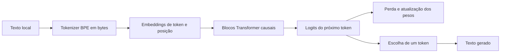

# Família Feneco

> **Modelos pequenos, especializados e avaliados para tarefas concretas.**

Este projeto não pretende competir com modelos gerais grandes como GPT ou Claude. Quero aprender a construir modelos e sistemas menores que façam muito bem um trabalho delimitado: ajudar com código, responder sobre um assunto específico ou pesquisar na web com fontes.

## Laboratório atual: Feneco-Token-0.1

O laboratório agora usa um decoder Transformer pequeno em Python e PyTorch com tokenização BPE em bytes. Em vez de um caractere por posição, o tokenizer aprende unidades de subpalavra e consegue representar texto UTF-8 fora do corpus. O checkpoint carrega o tokenizer que o criou; treino e geração precisam usar esse mesmo arquivo.

`Feneco-Char` continua disponível como histórico didático. Seus checkpoints antigos não podem ser continuados como BPE: embeddings e IDs mudaram e precisam ser aprendidos de novo. O Feneco-Token ainda é experimental e **não é um especialista nem um modelo útil para tarefas reais**.

O corpus em [`data/tiny.txt`](./data/tiny.txt) só serve para percorrer o fluxo. Com tão pouco texto, a geração é limitada e pode não fazer sentido.

Os livros que você reunir ficam em `data/livros` no clone local. Eles são a fonte inicial de pré-treino em português; não são corpus suficiente para ensinar pesquisa web ou garantir respostas corretas.

## A família de especialistas

Cada modelo Feneco terá uma tarefa e uma avaliação próprias. Algumas direções possíveis:

| Especialista | Trabalho que queremos avaliar | O que mais pode ser necessário |
| --- | --- | --- |
| **Feneco-Web-0.1** | Pesquisar uma pergunta, resumir evidências e citar fontes | Busca e leitura de páginas atuais; o modelo sozinho não sabe o que mudou na web |
| **Feneco-Code-0.1** | Completar, explicar ou revisar código numa linguagem e contexto definidos | Repositórios de avaliação isolados e execução controlada dos exemplos |
| **Feneco-[Assunto]-0.1** | Responder questões delimitadas de um domínio | Corpus autorizado e, quando necessário, busca em documentos de referência |

“Pequeno, mas poderoso” vai significar bom resultado numa tarefa definida, medido em exemplos que não entraram no treino. Tamanho de parâmetros, por si só, não é medida de capacidade.

Vamos começar pelo Feneco-Web, seguir para Feneco-Code e depois escolher um domínio específico. Para cada especialista, decidiremos com evidência se faz sentido treinar do zero, adaptar outro modelo ou combinar um modelo com recuperação de documentos e ferramentas. O Feneco-Char continua sendo nosso laboratório de fundamentos, não uma base pronta para todos os especialistas.

## Como o protótipo aprende



No treino, o modelo recebe IDs de tokens BPE e tenta prever o próximo token. Calculamos a perda e ajustamos os pesos. Na geração, escolhemos o próximo token e repetimos o processo.

## Clonar, treinar e acompanhar localmente

Requisitos: Git, Python 3.11 ou mais recente e PowerShell. Clone o repositório e prepare um ambiente isolado:

```powershell
git clone https://github.com/MorningloryFox/fox-language-models.git
cd LLM-From-Scratch
.\scripts\setup.ps1
```

Se estiver no Prompt de Comando (`cmd.exe`) em vez do PowerShell, chame os mesmos scripts assim:

```bat
powershell -NoProfile -ExecutionPolicy Bypass -File .\scripts\setup.ps1
powershell -NoProfile -ExecutionPolicy Bypass -File .\scripts\train.ps1
powershell -NoProfile -ExecutionPolicy Bypass -File .\scripts\evaluate.ps1
powershell -NoProfile -ExecutionPolicy Bypass -File .\scripts\history.ps1
```

O preparo instala PyTorch, Rich (para tabelas, painéis e barras de progresso no terminal), `tokenizers` (BPE em bytes) e o projeto no ambiente `.venv`. Se já clonou o projeto antes desta melhoria, atualize o clone e rode `.\scripts\setup.ps1` novamente para instalar a dependência.

Para iniciar um treino com o corpus didático:

```powershell
.\scripts\train.ps1
```

Para usar outro corpus local, mudar passos, contexto ou semente:

```powershell
.\scripts\train.ps1 -Data data/private/meu-corpus.txt -Steps 1000 -ContextLength 256 -Seed 42
```

O contexto padrão curto serve ao corpus didático. Para os livros, use 256 tokens como na próxima etapa.

O argumento `-Data` também aceita uma pasta com vários `.txt`. Nesse modo, o script embaralha os livros com a semente da execução e separa arquivos inteiros em treino, validação e teste, evitando que partes do mesmo livro apareçam nos três conjuntos. As proporções são aproximadas por quantidade de livros; como as obras têm tamanhos diferentes, as proporções em caracteres podem variar. Por exemplo:

```powershell
.\scripts\train.ps1 -Data data/livros -Steps 5000 -ContextLength 256 -Checkpoint checkpoints/feneco-token-livros-0.1.pt
```

### Extrair textos de vários PDFs

Organize os arquivos por assunto, colocando os livros em `data\livros` e outros materiais em pastas próprias, como `data\outroassunto`. A extração salva o `.txt` e o `.extraction.json` junto do PDF, mantendo cada assunto agrupado. Para processar a pasta inteira `data` e suas subpastas:

```powershell
.\scripts\extract-pdfs.ps1
```

O comando procura PDFs nas subpastas. Se o TXT já existir, ele é preservado; para substituir arquivos existentes, use `-Overwrite`. Também é possível indicar uma pasta por assunto ou um PDF específico:

```powershell
.\scripts\extract-pdfs.ps1 -Path "data\livros"
.\scripts\extract-pdfs.ps1 -Path "data\outroassunto"
.\scripts\extract-pdfs.ps1 -Path "data\ua000180.pdf"
```

A extração usa a camada de texto que já existe no PDF. Livros digitalizados como imagem precisam de OCR, e todo texto extraído deve ser revisado antes de entrar no corpus de treino. Os PDFs são preservados por padrão. Se quiser apagá-los após salvar um TXT com texto extraído e o respectivo JSON, use `-DeletePdf`:

```powershell
.\scripts\extract-pdfs.ps1 -DeletePdf
```

Com um único arquivo, o treino separa o texto em segmentos contíguos de 80/10/10. Com uma pasta de livros, cada obra fica inteira em apenas uma divisão. Em ambos os casos, a validação escolhe o melhor checkpoint e o teste fica de fora dessa escolha. Para avaliar o checkpoint de livros com mais lotes:

```powershell
.\scripts\evaluate.ps1 -Data data/livros -Checkpoint checkpoints/feneco-token-livros-0.1.pt -Batches 100
```

Gere texto com o checkpoint:

```powershell
.\.venv\Scripts\python.exe -m llm_from_scratch.generate --checkpoint checkpoints/feneco-token-livros-0.1.pt --prompt "O modelo"
```

Para abrir uma sessão interativa no PowerShell, em que você digita vários trechos sem executar o comando novamente:

```powershell
.\scripts\chat.ps1 -Checkpoint checkpoints/feneco-token-livros-0.1.pt
```

Digite `sair` para fechar. O contexto recente e a geração são contados em tokens BPE; este checkpoint de livros continua sendo um modelo de continuação de texto, ainda sem ajuste para instruções.

Cada treino acrescenta uma linha a `.local/experiments.jsonl`, com hash do corpus, revisão do código, configuração, contagens de parâmetros/cabeças, quantização, perdas, duração, dispositivo e tamanho do checkpoint. Consulte um resumo das execuções com:

```powershell
.\scripts\history.ps1
```

Checkpoints, histórico e corpus privado ficam em pastas ignoradas pelo Git. As perdas de Feneco-Char e Feneco-Token usam unidades diferentes e não devem ser comparadas diretamente. Nenhuma delas mede busca web, citações ou qualidade de resposta do Feneco-Web. Os scripts não publicam dados nem pesos.

### Preparar dados locais de conversa

O preparador usa por padrão um espelho público do OASST1 hospedado no Oxen.ai. Ele filtra mensagens marcadas como português (`pt`), preserva a origem e a licença declarada, reconstrói conversas e separa árvores inteiras em treino, validação e teste. O conjunto de origem não distingue consistentemente português brasileiro de europeu. Os Parquet baixados e os JSONL preparados ficam em `data/conversations/`, ignorada pelo Git.

Instale a dependência opcional uma vez:

```powershell
.\.venv\Scripts\python.exe -m pip install -e ".[data]"
```

Depois baixe e prepare as conversas:

```powershell
.\scripts\prepare-chat-data.ps1
```

São baixados dois Parquet, totalizando aproximadamente 42 MB. O manifesto registra tamanho e SHA-256 de cada arquivo, além das fontes, filtros, divisões e licença. O comando não contata o Hugging Face. O espelho oferece mensagens em português, mas não permite afirmar que todas sejam PT-BR.

Os diálogos ficam em `conversations/{train,validation,test}.jsonl`. `train.ps1` faz pré-treino causal em textos; `train-chat.ps1` ajusta as respostas do assistente usando o checkpoint BPE de livros.

### Ajustar o Feneco para responder em formato de conversa

O experimento `train-chat.ps1` carrega o tokenizer BPE e os pesos do checkpoint de livros, usa mensagens do usuário como contexto e calcula a perda apenas nos tokens das respostas do assistente. O contexto vem do checkpoint, recomendado em 256 tokens para livros. O dataset continua pequeno; o fluxo ensina o processo, sem expectativa de respostas comparáveis a um assistente geral.

```powershell
.\scripts\train-chat.ps1 -Steps 1000
```

O comando salva `checkpoints/feneco-chat-oasst1-token-0.1.pt` e registra as perdas de validação e teste em `.local/chat_experiments.jsonl`. Para abrir o modo interativo usando os marcadores de conversa aprendidos:

```powershell
.\scripts\chat.ps1 -Checkpoint checkpoints/feneco-chat-oasst1-token-0.1.pt -AssistantChat -Tokens 120
```

### Registro histórico: Feneco-Chat-OASST1-0.2 (por caractere)

O ajuste local usou 379 conversas para treino, 60 para validação e 40 para teste. A rodada 0.2 partiu da 0.1 e terminou em CPU após 5.000 passos.

| Configuração medida | Resultado |
| --- | ---: |
| Parâmetros totais e treináveis | 124.800 |
| Camadas e cabeças | 2 camadas • 4 cabeças por camada |
| Contexto e vocabulário | 64 caracteres • 161 caracteres distintos |
| Quantização | Nenhuma |
| Perda de validação, só caracteres de resposta do assistente | 2,0968 |
| Perda no teste reservado, só caracteres de resposta do assistente | 2,0897 |
| Duração em CPU | 347,6 s |
| Checkpoint local | `checkpoints/feneco-chat-oasst1-0.2.pt` (513.113 bytes) |

Uma geração de exemplo ainda saiu incoerente. Esses resultados são uma linha de base histórica por caractere; não são comparáveis às futuras métricas por BPE e não significam que o modelo já seja capaz de conversar.

Fontes: [OASST1](https://huggingface.co/datasets/OpenAssistant/oasst1), espelhado em [Oxen.ai](https://www.oxen.ai/OpenAssistant/oasst1/dir/main/). O cartão do conjunto declara Apache-2.0. Para preparar as fontes opcionais ainda hospedadas no Hugging Face, use `.\scripts\prepare-chat-data.ps1 -Sources portuguesechat,pt-corpus`; essa opção requer acesso ao Hugging Face e o Pt-Corpus tem 17 GB, textos gerais e licenças de origem variadas. Mantenha os dados localmente; não publique dados ou pesos sem revisar as condições de cada fonte.

## Como vamos medir

| Medida | Para que serve |
| --- | --- |
| Parâmetros, camadas e cabeças | Descrever tamanho e configuração, sem inferir capacidade |
| Perda de treino, validação e teste | Acompanhar previsão e generalização em partições separadas |
| Exemplos por tarefa | Medir o especialista no trabalho que queremos dele |
| Tempo, memória e dispositivo | Saber se cabe e responde bem na máquina-alvo |
| Fontes e cobertura | Para pesquisa/web, conferir se respostas se apoiam nas páginas consultadas |

O script atual registra configuração, contagens e perdas de treino/validação/teste. Ainda não há avaliação de qualidade para código ou pesquisa. Depois de cada treino, registraremos no README apenas os valores medidos daquela versão — parâmetros, cabeças, quantização se houver e resultados da avaliação. Configurações planejadas não serão apresentadas como métricas de um modelo treinado. Também não contamos “pensamentos”: conexões de atenção não são passos de raciocínio explícitos.

## Plano de trabalho

1. Entender o protótipo por caractere e suas métricas.
2. Separar avaliação de teste e registrar experimentos reproduzíveis.
3. Planejar e preparar fontes com licença e proveniência registradas para Feneco-Web.
4. Definir exemplos de sucesso/falha e comparar dados, busca e estratégia de treino.
5. Treinar e testar localmente; medir qualidade, custo e limites.
6. Depois, planejar Feneco-Code e um especialista de domínio.
7. Só então decidir se publicamos código, pesos ou nenhum artefato no GitHub.

O [guia de estudo](./knowledge/README.md) cobre os fundamentos técnicos. As notas sobre [modelos especialistas](./knowledge/Specialist_Models.md) e [fontes de dados](./knowledge/Data_Sources_and_Collection.md) explicam como vamos planejar a família e seus corpora.

## Licença

MIT. Consulte [`LICENSE`](./LICENSE).
