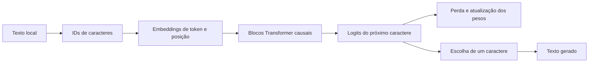

# Família Feneco

> **Modelos pequenos, especializados e avaliados para tarefas concretas.**

Este projeto não pretende competir com modelos gerais grandes como GPT ou Claude. Quero aprender a construir modelos e sistemas menores que façam muito bem um trabalho delimitado: ajudar com código, responder sobre um assunto específico ou pesquisar na web com fontes.

## Laboratório atual: Feneco-Char-0.1

O protótipo atual é um decoder Transformer pequeno em Python e PyTorch. Ele lê um caractere por vez e aprende a prever o próximo caractere num corpus local. É um exercício para entender tensores, atenção, treino e geração; **ainda não é um especialista nem um modelo útil para tarefas reais**.

O corpus em [`data/tiny.txt`](./data/tiny.txt) só serve para percorrer o fluxo. Com tão pouco texto, a geração é limitada e pode não fazer sentido.

Também incluímos [`data/ua000180.txt`](./data/ua000180.txt), uma transcrição em texto simples do conto *A Carteira*, de Machado de Assis. A origem e as observações sobre a extração estão em [`data/ua000180.metadata.json`](./data/ua000180.metadata.json). Esse texto serve para experimentar o fluxo com uma obra literária em português; não é corpus suficiente para formar a base compartilhada nem ensinar pesquisa web.

## A família de especialistas

Cada modelo Feneco terá uma tarefa e uma avaliação próprias. Algumas direções possíveis:

| Especialista | Trabalho que queremos avaliar | O que mais pode ser necessário |
| --- | --- | --- |
| **Feneco-Web-0.1** | Pesquisar uma pergunta, resumir evidências e citar fontes | Busca e leitura de páginas atuais; o modelo sozinho não sabe o que mudou na web |
| **Feneco-Code-0.1** | Completar, explicar ou revisar código numa linguagem e contexto definidos | Repositórios de avaliação isolados e execução controlada dos exemplos |
| **Feneco-[Assunto]-0.1** | Responder questões delimitadas de um domínio | Corpus autorizado e, quando necessário, busca em documentos de referência |

“Pequeno, mas poderoso” vai significar bom resultado numa tarefa definida, medido em exemplos que não entraram no treino. Tamanho de parâmetros, por si só, não é medida de capacidade.

Vamos começar pelo Feneco-Web, seguir para Feneco-Code e depois escolher um domínio específico. Para cada especialista, decidiremos com evidência se faz sentido treinar do zero, adaptar outro modelo ou combinar um modelo com recuperação de documentos e ferramentas. O Feneco-Char continua sendo nosso laboratório de fundamentos, não uma base pronta para todos os especialistas.

## Como o protótipo aprende



No treino, o modelo recebe uma sequência e tenta prever o próximo caractere. Calculamos a perda e ajustamos os pesos. Na geração, escolhemos o próximo caractere e repetimos o processo.

## Clonar, treinar e acompanhar localmente

Requisitos: Git, Python 3.11 ou mais recente e PowerShell. Clone o repositório e prepare um ambiente isolado:

```powershell
git clone https://github.com/MorningloryFox/LLM-From-Scratch.git
cd LLM-From-Scratch
.\scripts\setup.ps1
```

Se estiver no Prompt de Comando (`cmd.exe`) em vez do PowerShell, chame os mesmos scripts assim:

```bat
powershell -NoProfile -ExecutionPolicy Bypass -File .\scripts\setup.ps1
powershell -NoProfile -ExecutionPolicy Bypass -File .\scripts\train.ps1
powershell -NoProfile -ExecutionPolicy Bypass -File .\scripts\evaluate.ps1
powershell -NoProfile -ExecutionPolicy Bypass -File .\scripts\history.ps1
```

O preparo instala PyTorch, Rich (para tabelas, painéis e barras de progresso no terminal) e o projeto no ambiente `.venv`. Se já clonou o projeto antes desta melhoria, atualize o clone e rode `.\scripts\setup.ps1` novamente para instalar a dependência.

Para iniciar um treino com o corpus didático:

```powershell
.\scripts\train.ps1
```

Para usar outro corpus local, mudar passos, contexto ou semente:

```powershell
.\scripts\train.ps1 -Data data/private/meu-corpus.txt -Steps 1000 -ContextLength 64 -Seed 42
```

Para treinar o laboratório com o conto incluído:

```powershell
.\scripts\train.ps1 -Data data/ua000180.txt
```

### Extrair textos de vários PDFs

Organize os arquivos por assunto, colocando os livros em `data\livros` e outros materiais em pastas próprias, como `data\outroassunto`. A extração salva o `.txt` e o `.extraction.json` junto do PDF, mantendo cada assunto agrupado. Para processar a pasta inteira `data` e suas subpastas:

```powershell
.\scripts\extract-pdfs.ps1
```

O comando procura PDFs nas subpastas. Se o TXT já existir, ele é preservado; para substituir arquivos existentes, use `-Overwrite`. Também é possível indicar uma pasta por assunto ou um PDF específico:

```powershell
.\scripts\extract-pdfs.ps1 -Path "data\livros"
.\scripts\extract-pdfs.ps1 -Path "data\outroassunto"
.\scripts\extract-pdfs.ps1 -Path "data\ua000180.pdf"
```

A extração usa a camada de texto que já existe no PDF. Livros digitalizados como imagem precisam de OCR, e todo texto extraído deve ser revisado antes de entrar no corpus de treino. Os PDFs são preservados por padrão. Se quiser apagá-los após salvar um TXT com texto extraído e o respectivo JSON, use `-DeletePdf`:

```powershell
.\scripts\extract-pdfs.ps1 -DeletePdf
```

O treino separa o texto em segmentos contíguos de 80% para treino, 10% para validação e 10% para teste. A validação escolhe o melhor checkpoint; o teste fica de fora dessa escolha. Ao final, o terminal mostra parâmetros, camadas, cabeças, perdas e onde salvou o checkpoint. Para repetir a avaliação do conjunto de teste com mais lotes:

```powershell
.\scripts\evaluate.ps1 -Data data/private/meu-corpus.txt -Batches 100
```

Gere texto com o checkpoint:

```powershell
.\.venv\Scripts\python.exe -m llm_from_scratch.generate --checkpoint checkpoints/feneco-char-0.1.pt --prompt "O modelo"
```

Para abrir uma sessão interativa no PowerShell, em que você digita vários trechos sem executar o comando novamente:

```powershell
.\scripts\chat.ps1 -Checkpoint checkpoints/feneco-char-0.1.pt
```

Digite `sair` para fechar. O modo interativo mantém apenas o contexto recente em caracteres; este protótipo continua texto e ainda não é um assistente treinado para diálogo ou instruções.

Cada treino acrescenta uma linha a `.local/experiments.jsonl`, com hash do corpus, revisão do código, configuração, contagens de parâmetros/cabeças, quantização, perdas, duração, dispositivo e tamanho do checkpoint. Consulte um resumo das execuções com:

```powershell
.\scripts\history.ps1
```

Checkpoints, histórico e corpus privado ficam em pastas ignoradas pelo Git. A contagem e a perda atuais são métricas do laboratório **por caractere**; elas ainda não medem busca web, citações ou qualidade de resposta do Feneco-Web. Os scripts não publicam dados nem pesos.

## Como vamos medir

| Medida | Para que serve |
| --- | --- |
| Parâmetros, camadas e cabeças | Descrever tamanho e configuração, sem inferir capacidade |
| Perda de treino, validação e teste | Acompanhar previsão e generalização em partições separadas |
| Exemplos por tarefa | Medir o especialista no trabalho que queremos dele |
| Tempo, memória e dispositivo | Saber se cabe e responde bem na máquina-alvo |
| Fontes e cobertura | Para pesquisa/web, conferir se respostas se apoiam nas páginas consultadas |

O script atual imprime configuração, contagens e perdas de treino/validação. Ainda não há teste separado nem avaliação de código ou pesquisa. Depois de cada treino, registraremos no README apenas os valores medidos daquela versão — parâmetros, cabeças, quantização se houver e resultados da avaliação. Configurações planejadas não serão apresentadas como métricas de um modelo treinado. Também não contamos “pensamentos”: conexões de atenção não são passos de raciocínio explícitos.

## Plano de trabalho

1. Entender o protótipo por caractere e suas métricas.
2. Separar avaliação de teste e registrar experimentos reproduzíveis.
3. Planejar e preparar fontes com licença e proveniência registradas para Feneco-Web.
4. Definir exemplos de sucesso/falha e comparar dados, busca e estratégia de treino.
5. Treinar e testar localmente; medir qualidade, custo e limites.
6. Depois, planejar Feneco-Code e um especialista de domínio.
7. Só então decidir se publicamos código, pesos ou nenhum artefato no GitHub.

O [guia de estudo](./knowledge/README.md) cobre os fundamentos técnicos. As notas sobre [modelos especialistas](./knowledge/Specialist_Models.md) e [fontes de dados](./knowledge/Data_Sources_and_Collection.md) explicam como vamos planejar a família e seus corpora.

## Licença

MIT. Consulte [`LICENSE`](./LICENSE).
