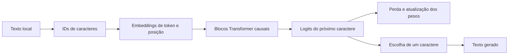

# Família Feneco

> **Modelos pequenos, especializados e avaliados para tarefas concretas.**

Este projeto não pretende competir com modelos gerais grandes como GPT ou Claude. Quero aprender a construir modelos e sistemas menores que façam muito bem um trabalho delimitado: ajudar com código, responder sobre um assunto específico ou pesquisar na web com fontes.

## Primeiro membro: Feneco-Char-0.1

O protótipo atual é um decoder Transformer pequeno em Python e PyTorch. Ele lê um caractere por vez e aprende a prever o próximo caractere num corpus local. É um exercício para entender tensores, atenção, treino e geração; **ainda não é um especialista nem um modelo útil para tarefas reais**.

O corpus em [`data/tiny.txt`](./data/tiny.txt) só serve para percorrer o fluxo. Com tão pouco texto, a geração é limitada e pode não fazer sentido.

## A família de especialistas

Cada modelo Feneco terá uma tarefa e uma avaliação próprias. Algumas direções possíveis:

| Especialista | Trabalho que queremos avaliar | O que mais pode ser necessário |
| --- | --- | --- |
| **Feneco-Code** | Completar, explicar ou revisar código numa linguagem e contexto definidos | Repositórios de avaliação isolados e execução controlada dos exemplos |
| **Feneco-[Assunto]** | Responder questões delimitadas de um domínio | Corpus autorizado e, quando necessário, busca em documentos de referência |
| **Feneco-Research** | Pesquisar uma pergunta, resumir evidências e citar fontes | Busca e leitura de páginas atuais; o modelo sozinho não sabe o que mudou na web |

“Pequeno, mas poderoso” vai significar bom resultado numa tarefa definida, medido em exemplos que não entraram no treino. Tamanho de parâmetros, por si só, não é medida de capacidade.

Para cada especialista, vamos decidir com evidência se faz sentido treinar do zero, adaptar outro modelo ou combinar um modelo com recuperação de documentos e ferramentas. O Feneco-Char continua sendo nosso laboratório de fundamentos; não vamos tratá-lo como base pronta para todos os especialistas.

## Como o protótipo aprende



No treino, o modelo recebe uma sequência e tenta prever o próximo caractere. Calculamos a perda e ajustamos os pesos. Na geração, escolhemos o próximo caractere e repetimos o processo.

## Rodar na máquina local

Requisitos: Python 3.11 ou mais recente e PyTorch. Na raiz do repositório, no PowerShell:

```powershell
python -m venv .venv
.\.venv\Scripts\Activate.ps1
python -m pip install -e .
python -m llm_from_scratch.train --data data/tiny.txt --steps 500
python -m llm_from_scratch.generate --checkpoint checkpoints/feneco-char-0.1.pt --prompt "O modelo"
```

O checkpoint fica em `checkpoints/`, que é ignorada pelo Git. Corpus privado deve ficar em `data/private/`, também ignorada. Vamos treinar e avaliar nesta máquina; depois decidimos se algum peso treinado deve ser compartilhado. Nada será incluído no Git automaticamente.

## Como vamos medir

| Medida | Para que serve |
| --- | --- |
| Parâmetros, camadas e cabeças | Descrever tamanho e configuração, sem inferir capacidade |
| Perda de treino, validação e teste | Acompanhar previsão e generalização em partições separadas |
| Exemplos por tarefa | Medir o especialista no trabalho que queremos dele |
| Tempo, memória e dispositivo | Saber se cabe e responde bem na máquina-alvo |
| Fontes e cobertura | Para pesquisa/web, conferir se respostas se apoiam nas páginas consultadas |

O script atual imprime configuração, contagens e perdas de treino/validação. Ainda não há teste separado nem avaliação de código ou pesquisa. Também não contamos “pensamentos”: conexões de atenção não são passos de raciocínio explícitos.

## Plano de trabalho

1. Entender o protótipo por caractere e suas métricas.
2. Separar avaliação de teste e registrar experimentos reproduzíveis.
3. Escolher **um** especialista inicial e definir exemplos de sucesso e falha antes de treinar.
4. Preparar dados autorizados e comparar a estratégia de treino adequada para essa tarefa.
5. Treinar e testar localmente; medir qualidade, custo e limites.
6. Só depois decidir se publicamos código, pesos ou nenhum artefato no GitHub.

O [guia de estudo](./knowledge/README.md) cobre os fundamentos técnicos. A nota sobre [modelos especialistas](./knowledge/Specialist_Models.md) explica como vamos planejar a família.

## Licença

MIT. Consulte [`LICENSE`](./LICENSE).
