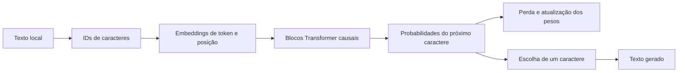

# Mirim-0.1

> **Um modelo pequeno, feito para aprender por dentro.**

Este repositório acompanha a construção do **Mirim**, um modelo de linguagem decoder-only implementado em Python e PyTorch. A ideia é começar com uma versão mínima que roda nesta máquina, entender o que cada parte faz e evoluir com experimentos que possamos medir e repetir.

O nome **Mirim** é um nome de trabalho: combina com o tamanho inicial do modelo e pode mudar conforme o projeto crescer.

## O que existe hoje

- Um decoder Transformer pequeno, escrito no projeto, com atenção causal.
- Tokenização por caractere: simples de inspecionar, mas ineficiente para texto real.
- Treino local para prever o próximo caractere.
- Geração de texto a partir de um prefixo.
- Um corpus de demonstração em [`data/tiny.txt`](./data/tiny.txt).

O corpus é só uma amostra para percorrer o fluxo. O Mirim não é um assistente nem um modelo de conhecimento geral: com esses dados, ele aprende padrões muito limitados e provavelmente gera texto sem sentido.

## Como o texto vira geração



No treino, o modelo recebe uma sequência e tenta prever o próximo caractere em cada posição. Comparamos as previsões com os alvos, calculamos a perda e ajustamos os pesos. Na geração, escolhemos um próximo caractere e repetimos o processo.

## Rodar na máquina local

Requisitos: Python 3.11 ou mais recente e PyTorch. Na raiz do repositório, no PowerShell:

```powershell
python -m venv .venv
.\.venv\Scripts\Activate.ps1
python -m pip install -e .
python -m llm_from_scratch.train --data data/tiny.txt --steps 500
python -m llm_from_scratch.generate --checkpoint checkpoints/mirim-0.1.pt --prompt "O modelo"
```

O treino cria `checkpoints/mirim-0.1.pt`. Checkpoints e textos em `data/private/` ficam locais e são ignorados pelo Git. Vamos treinar e avaliar aqui; depois decidimos se algum artefato treinado deve ser compartilhado. O código-fonte e as notas podem evoluir por commits sem incluir pesos nem corpus privado.

## O que vamos acompanhar

Para comparar experimentos, vamos registrar configurações e medidas, sem confundir tamanho com capacidade:

| Medida | O que nos diz |
| --- | --- |
| Parâmetros treináveis | Quantos valores o otimizador pode ajustar |
| Camadas e cabeças de atenção | Como o modelo está configurado; cabeças são contadas por camada e no total |
| Caracteres/tokens e tamanho do vocabulário | Quanto texto entrou e quantas unidades distintas foram usadas |
| Perda de treino e validação | Se o modelo aprende o corpus e se generaliza para trechos separados |
| Tempo, dispositivo e configuração | Se os resultados podem ser comparados e repetidos |
| Amostras geradas | Como as previsões se comportam, além do número da perda |

O script imprime dispositivo, tamanho do corpus, vocabulário, parâmetros treináveis, cabeças e conexões causais permitidas, além das perdas de treino/validação. Ainda faltam um conjunto de teste separado, registro persistente de experimentos e amostras salvas. Vamos acrescentar essas medidas quando estudarmos o ciclo de avaliação.

“Grafo de pensamento” não é uma contagem que este modelo já tenha. Um Transformer calcula conexões de atenção entre posições; isso não corresponde, por si só, a pensamentos ou raciocínio explícito. Se quisermos explorar grafos como estruturas de nós e relações, vamos defini-los e medi-los como um experimento separado.

## Roteiro de estudo

As notas em [`knowledge/`](./knowledge/) explicam as ideias e apontam como elas aparecem — ou ainda não aparecem — no código. O [guia de estudo](./knowledge/README.md) reúne a sequência completa.

1. [Embeddings e geometria](./knowledge/Embeddings_Vector_Geometry.md) e [tokenização](./knowledge/Tokenization.md).
2. [Atenção causal](./knowledge/Attention_Mechanism.md), [bloco Transformer](./knowledge/Transformer_Block.md) e [RoPE](./knowledge/RotaryPositionEmbedding.md).
3. [Treino e avaliação](./knowledge/Training_and_Evaluation.md) e [geração e amostragem](./knowledge/Text_Generation.md).
4. [Métricas do modelo e conexões de atenção](./knowledge/Model_Metrics_and_Attention_Graphs.md).
5. [Cache KV](./knowledge/KV_Cache.md) e [quantização](./knowledge/Quantization.md), quando a versão básica estiver compreendida.

## Estrutura

```text
src/llm_from_scratch/   modelo, treino e geração
data/tiny.txt           corpus de demonstração
knowledge/              notas de estudo
checkpoints/             pesos locais, fora do Git
```

## Licença

MIT. Consulte [`LICENSE`](./LICENSE).
